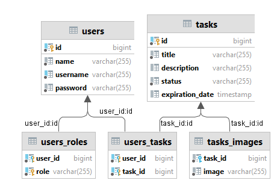

# Task manager API: manage your task in a programmer way :)

<p>
A simple and flexible task management web application building with REST API by Spring Boot.
</p>

To check how it works you can send requests via Swagger:

`http://localhost:8080/swagger-ui/index.html`

Minimum required software to install the project is:

- Java 17;
- Spring Boot 3.1.2;
- Maven;
- Database (Postgres by default and cache with Redis)
- Storage (Minio by default)

## Tools

This project was built using these tools:

| Tool                                             | Description                                                                                                                                                                                                                        |
|--------------------------------------------------|------------------------------------------------------------------------------------------------------------------------------------------------------------------------------------------------------------------------------------|
| [maven](https://maven.apache.org/)               | "Apache Maven is a software project management and comprehension tool. Based on the concept of a project object model (POM), Maven can manage a project's build, reporting and documentation from a central piece of information." |
| [spring](https://spring.io/projects/spring-boot) | "Spring Boot makes it easy to create stand-alone, production-grade Spring based Applications that you can "just run"."                                                                                                             |
| [hibernate](https://hibernate.org/)              | "Idiomatic persistence for Java and relational databases."                                                                                                                                                                         |
| [liquibase](https://www.liquibase.org/)          | "Liquibase is an open-source database schema change management solution which enables you to manage revisions of your database changes easily."                                                                                    |
| [JWT](https://jwt.io/)                           | "JSON Web Tokens are an open, industry standard RFC 7519 method for representing claims securely between two parties."                                                                                                             |
| [swagger](https://swagger.io/)                   | "Simplify API development for users, teams, and enterprises with the Swagger open source and professional toolset."                                                                                                                |
| [minio](https://min.io/)                         | "A high-performance, S3 compatible object store."                                                                                                                                                                                  |

## Sequence diagram


## Class diagram



## Installation

You can use [Docker Compose](https://docs.docker.com/compose/) to do all the routines. To use it you also
need [Docker](https://docs.docker.com/desktop/) installed.

Clone the project:

```bash
>> git clone https://github.com/GunGalla/spring-rest-test.git
```

Create `.env` file in the root folder and add following variables:

```dotenv
HOST='host of Postgresql database'
POSTGRES_USERNAME='username for Postgresql database'
POSTGRES_PASSWORD='password for Postgresql database'
POSTGRES_DATABASE='name of Postgresql database'
POSTGRES_SCHEMA='name of Postgresql schema'
REDIS_HOST='host of Redis instance'
REDIS_PASSWORD='password for Redis'
JWT_SECRET='secret string for JWT tokens'
MINIO_BUCKET='name of bucket for MinIO'
MINIO_URL='URL of MinIO instance'
MINIO_ACCESS_KEY='access key of MinIO'
MINIO_SECRET_KEY='secret key of MinIO'
```

And run:

```shell
>> docker-compose up
```

The server is running at localhost and you can skip directly to [Swagger](http://localhost:8080/swagger-ui/index.html).
